# README

## 프로젝트 clone

1. 구름 IDE 컨테이너를 만듭니다. (반드시 구름 IDE를 사용할 필요는 없습니다.)  
   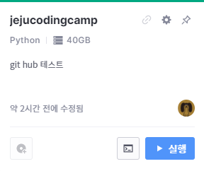
2. 컨테이너를 실행합니다. 컨테이너 생성시 자동으로 만들어지는 `README.md` 또는 `index.py`는 지우셔도 무방합니다.  
   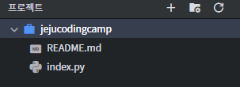

3. 다음 명령어로 저장소를 복사해옵니다.  

   ```shell
   git clone https://github.com/paullabkorea/jejucodingcamp.git
   ```

   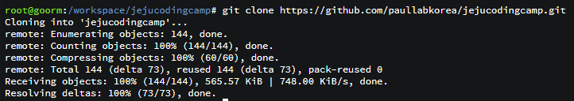  
   그러면 해당 프로젝트의 폴더가 복사되어집니다. 해당 프로젝트 폴더의 이름은 원하는 이름으로 바꾸어도 무방합니다.  
   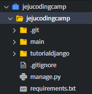

## 가상환경 생성

1. `cd` 명령어를 통해 프로젝트 폴더로 이동합니다.  

   ```shell
   cd jejucodingcamp
   ```

   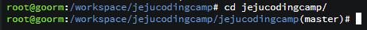

2. 다음 명령어를 통해 가상환경을 생성합니다.  가상환경 이름인 `myvenv`는 원하는 이름으로 바꾸어도 무방합니다.

   ```shell
   python -m venv myvenv
   ```

   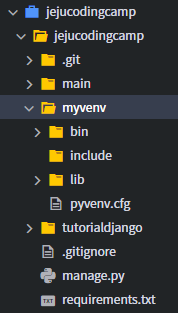

3. 다음 명령어를 통해 가상환경을 활성화합니다.  

   ```shell
   source myvenv/bin/activate
   ```

   명령줄 앞에 가상환경 이름이 붙었다면 활성화된 것입니다.  
   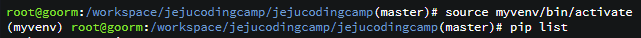

4. 다음 명령어를 통해 `requirements.txt`에 정리된 필요한 모듈들을 설치합니다.  

   ```shell
   pip install -r requirements.txt
   ```

   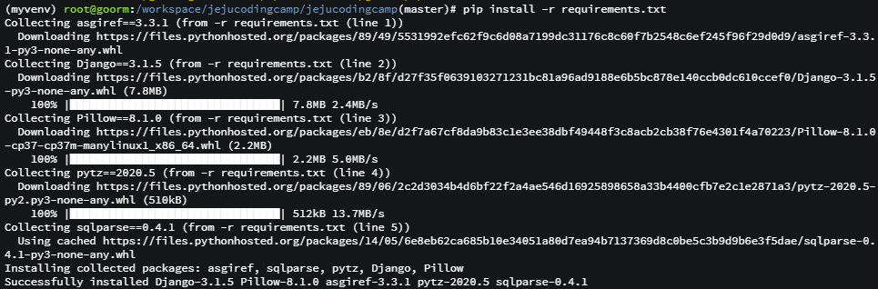

## 프로젝트 실행

1. 다음 명령어를 통해 DB를 생성합니다.  

   ```shell
   python manage.py migrate
   ```

   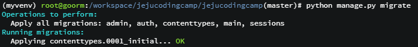

2. 다음 명령어를 통해 프로젝트를 실행합니다.

   ```shell
   python manage.py runserver 0:80
   ```

3. 구름 IDE 메뉴에서 `프로젝트` > `실행 URL과 포트` 를 엽니다.  
   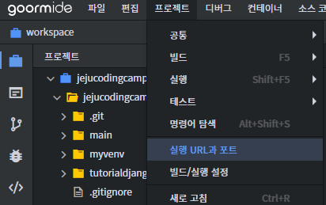

4. 80번 포트로 등록된 URL로 접속합니다.  
   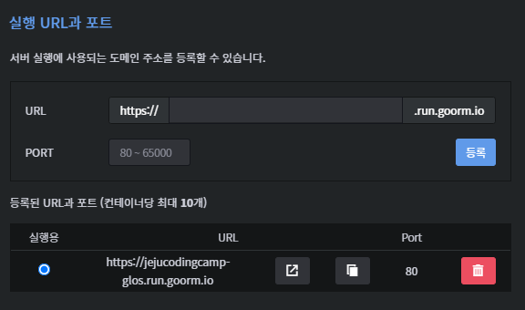
5. 다음 화면이 나오면 프로젝트를 성공적으로 실행한 것입니다.  
   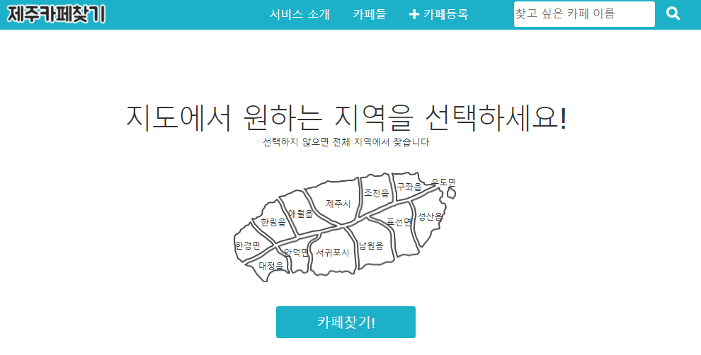